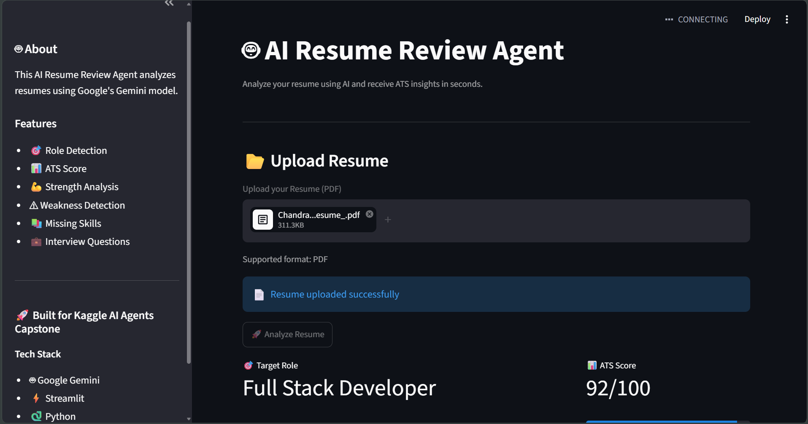

# 🤖 AI Resume Review Agent

An AI-powered Resume Review Agent that analyzes resumes, estimates ATS compatibility, identifies strengths and weaknesses, suggests missing skills, and generates personalized interview questions using Google's Gemini model.

---

## 🚀 Problem Statement

Recruiters spend very little time reviewing each resume, and many candidates don't know whether their resumes are ATS-friendly.

This project helps job seekers receive instant AI-powered feedback on their resumes by providing:

- ATS Compatibility Score
- Target Role Detection
- Resume Summary
- Strength Analysis
- Weakness Detection
- Missing Skills
- Personalized Interview Questions

---

## ✨ Features

- 📄 Upload Resume in PDF format
- 🎯 Detects the candidate's target job role
- 📊 Generates an ATS Compatibility Score
- 💪 Identifies resume strengths
- ⚠ Highlights weaknesses
- 📚 Suggests missing skills
- 💼 Generates personalized interview questions
- 🤖 Powered by Google Gemini AI
- 🌐 Interactive Streamlit dashboard

---

## 🏗️ System Architecture

```
                Streamlit UI
                     │
                     ▼
          Upload Resume (PDF)
                     │
                     ▼
              PDF Reader Tool
                     │
                     ▼
          Extract Resume Text
                     │
                     ▼
          Resume Review Agent
                     │
                     ▼
          Google Gemini API
                     │
                     ▼
        Structured JSON Response
                     │
      ┌──────────────┼──────────────┐
      ▼              ▼              ▼
 ATS Report   Missing Skills   Interview Questions
                     │
                     ▼
            Streamlit Dashboard
```

---

## 📂 Project Structure

```
AI-Resume-Review-Agent
│
├── agent/
│   ├── resume_agent.py
│   ├── prompts.py
│   ├── role_identifier.py
│   ├── ats_analyzer.py
│   └── interview_generator.py
│
├── tools/
│   └── pdf_reader.py
│
├── resumes/
│
├── assets/
│   └── ui.png
│
├── app.py
├── requirements.txt
├── .env.example
├── .gitignore
└── README.md
```

---

## 🛠️ Tech Stack

- Python
- Streamlit
- Google Gemini API
- PyMuPDF
- python-dotenv

---

## ⚙️ Installation

Clone the repository

```bash
git clone https://github.com/YOUR_USERNAME/AI-Resume-Review-Agent.git
```

Move into the project folder

```bash
cd AI-Resume-Review-Agent
```

Create a virtual environment

```bash
python -m venv venv
```

Activate the virtual environment

### Windows

```bash
venv\Scripts\activate
```

### macOS/Linux

```bash
source venv/bin/activate
```

Install dependencies

```bash
pip install -r requirements.txt
```

Create a `.env` file

```env
GEMINI_API_KEY=YOUR_API_KEY
```

Run the application

```bash
streamlit run app.py
```

---

## 📸 Application Screenshot

### AI Resume Review Dashboard



---

## 🎯 How It Works

1. Upload a resume in PDF format.
2. The PDF Reader extracts resume text.
3. The Resume Review Agent processes the content.
4. Google Gemini analyzes the resume.
5. The application generates:
   - ATS Score
   - Resume Summary
   - Strengths
   - Weaknesses
   - Missing Skills
   - Personalized Interview Questions
6. Results are displayed in the Streamlit dashboard.

---

## 🔒 Security

- API keys are stored securely using environment variables.
- `.env` is excluded using `.gitignore`.
- No sensitive user data is stored.

---

## 🚀 Future Improvements

- Google ADK Integration
- Multi-agent architecture
- Resume comparison
- Job Description matching
- Downloadable PDF reports
- Multi-language support

---

## 👩‍💻 Author

**Chandralata Trivedi**

Computer Engineering Student

Built for the **Kaggle AI Agents: Intensive Vibe Coding Capstone Project** 🚀