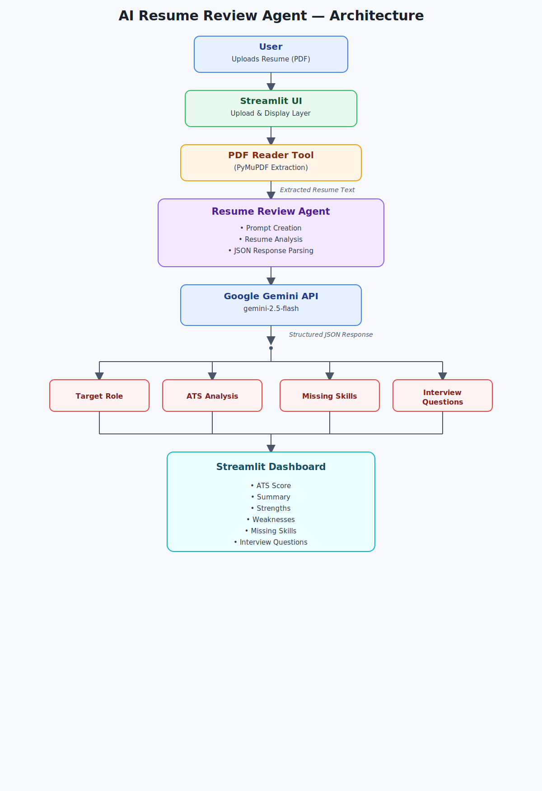

# AI Resume Review Agent

An AI-powered Resume Review Agent that analyzes resumes, estimates ATS compatibility, identifies strengths and weaknesses, recommends missing skills, and generates personalized interview questions using Google's Gemini AI.

Built as part of the Kaggle **AI Agents: Intensive Vibe Coding Capstone Project**.

---

## Overview

Recruiters typically spend only a few seconds reviewing a resume, and many applicants are unaware of how Applicant Tracking Systems (ATS) evaluate their profiles.

This project helps candidates instantly evaluate their resumes by providing:

- ATS Compatibility Score
- Target Role Detection
- Professional Resume Summary
- Strength Analysis
- Weakness Detection
- Missing Skill Recommendations
- Personalized Technical Interview Questions

The application provides all insights through an interactive Streamlit dashboard powered by Google's Gemini model.

---

## Features

- Upload resumes in PDF format
- Automatic resume text extraction
- AI-powered ATS compatibility analysis
- Target job role identification
- Resume summary generation
- Strength and weakness analysis
- Missing skill recommendations
- Personalized interview question generation
- Interactive Streamlit interface

---

## System Architecture

The following diagram illustrates the overall workflow of the AI Resume Review Agent.



---

## Project Structure

```text
AI-Resume-Review-Agent
│
├── agent
│   ├── resume_agent.py
│   ├── prompts.py
│   ├── role_identifier.py
│   ├── ats_analyzer.py
│   └── interview_generator.py
│
├── tools
│   └── pdf_reader.py
│
├── resumes
├── assets
│   └── ui.png
│
├── app.py
├── requirements.txt
├── .env.example
├── .gitignore
└── README.md
```

---

## Technology Stack

- Python
- Streamlit
- Google Gemini API
- PyMuPDF
- python-dotenv

---

## Installation

Clone the repository

```bash
git clone https://github.com/chandralata18/AI-Resume-Review-Agent.git
```

Navigate to the project directory

```bash
cd AI-Resume-Review-Agent
```

Create a virtual environment

```bash
python -m venv venv
```

Activate the environment

Windows

```bash
venv\Scripts\activate
```

macOS / Linux

```bash
source venv/bin/activate
```

Install dependencies

```bash
pip install -r requirements.txt
```

Create a `.env` file in the project root.

```env
GEMINI_API_KEY=YOUR_API_KEY
```

Run the application

```bash
streamlit run app.py
```

---

## Application Preview

### AI Resume Review Dashboard


---

## Workflow

1. Upload a resume in PDF format.
2. Extract resume text using the PDF Reader.
3. Send the extracted text to the Resume Review Agent.
4. Analyze the resume using Google's Gemini model.
5. Generate:
   - ATS Compatibility Score
   - Target Role
   - Resume Summary
   - Strengths
   - Weaknesses
   - Missing Skills
   - Personalized Interview Questions
6. Display the results in the Streamlit dashboard.

---

## Security

- API keys are managed using environment variables.
- Sensitive credentials are excluded from version control through `.gitignore`.
- No user data is stored after analysis.

---

## Future Improvements

- Google ADK integration
- Multi-agent workflow
- Resume vs Job Description matching
- Downloadable PDF reports
- Resume version comparison
- Multi-language support

---

## Author

**Chandralata Trivedi**
